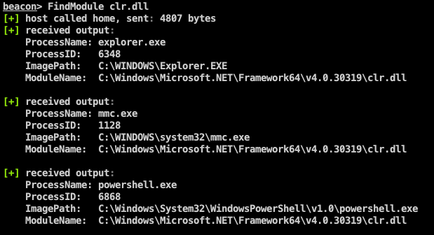
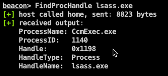

# FindObjects-BOF #

A Cobalt Strike Beacon Object File (BOF) project which uses [direct system calls](https://outflank.nl/blog/2019/06/19/red-team-tactics-combining-direct-system-calls-and-srdi-to-bypass-av-edr/) to enumerate processes for specific modules or process handles.

### What is this repository for? ###

* Use direct systems calls within Beacon Object files to enumerate processes for specific loaded modules (e.g. winhttpd.dll, amsi.dll or clr.dll).
* Use direct systems calls within Beacon Object files to enumerate processes for specific process handles (e.g. lsass.exe).
* Avoid using the Windows and Native APIs as much as possible (to avoid userland hooks).
* Execute this code within the beacon process using [Beacon object files](https://www.cobaltstrike.com/help-beacon-object-files) to avoid fork&run.

### Why do i need this? ###

Utilizing [direct systems calls via inline assembly in BOF code](https://outflank.nl/blog/2020/12/26/direct-syscalls-in-beacon-object-files/) provides a more opsec safe way of interacting with the system. Using direct system calls avoids AV/EDR software intercepting user-mode API calls. 

* The ``FindModule`` bof can be used to identify processes which have a certain module loaded, for example the .NET runtime ``clr.dll`` or the ``winhttp.dll`` module. This information can be used to select a more opsec safe spawnto candidate when using Cobalt Strike's ``execute-assembly`` or before injecting an exfill beacon shellcode using the ``shinject`` command.

  

* The ``FindProcHandle`` bof can be used to identify processes with a specific process handle in use, for example processes using a handle to the  ``lsass.exe`` process. If there's a process within the system with a ``lsass.exe`` process handle, we could use this existing process/handle to read or write memory without opening a new process handle. This bypasses certain AV/EDR's capabilities of detecting and blocking LSASS process/memory access.

  

### How do I set this up? ###

We will not supply compiled binaries. You will have to do this yourself:
* Clone this repository.
* Make sure you have the Mingw-w64 compiler installed. On Mac OSX for example, you can use the ports collection to install Mingw-w64 (``sudo port install mingw-w64``).
* Run the ``make`` command to compile the Beacon object file.
* Within Cobalt Strike use the ``Script Manager`` to load the **FindObjects.cna** script.
* Within a Cobalt Strike beacon context use the ``FindProcHandle`` or ``FindModule`` command with the required parameters (e.g. module or process name).
